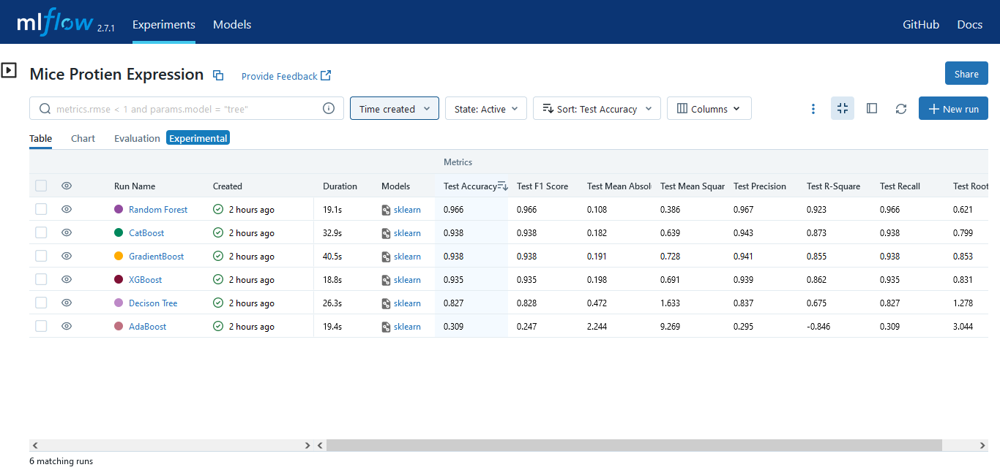

# Mice-Protein-Expression

The data set consists of the expression levels of 77 proteins/protein modifications that produced detectable signals in the nuclear fraction of cortex. There are 38 control mice and 34 trisomic mice (Down syndrome), for a total of 72 mice. In the experiments, 15 measurements were registered of each protein per sample/mouse. Therefore, for control mice, there are 38x15, or 570 measurements, and for trisomic mice, there are 34x15, or 510 measurements. The dataset contains a total of 1080 measurements per protein. Each measurement can be considered as an independent sample/mouse.


The eight classes of mice are described based on features such as genotype, behavior and treatment. According to genotype, mice can be control or trisomic. According to behavior, some mice have been stimulated to learn (context-shock) and others have not (shock-context) and in order to assess the effect of the drug memantine in recovering the ability to learn in trisomic mice, some mice have been injected with the drug and others have not.

Classes:
1. c-CS-s: control mice, stimulated to learn, injected with saline (9 mice)
2. c-CS-m: control mice, stimulated to learn, injected with memantine (10 mice)
3. c-SC-s: control mice, not stimulated to learn, injected with saline (9 mice)
4. c-SC-m: control mice, not stimulated to learn, injected with memantine (10 mice)
5. t-CS-s: trisomy mice, stimulated to learn, injected with saline (7 mice)
6. t-CS-m: trisomy mice, stimulated to learn, injected with memantine (9 mice)
7. t-SC-s: trisomy mice, not stimulated to learn, injected with saline (9 mice)
8. t-SC-m: trisomy mice, not stimulated to learn, injected with memantine (9 mice)

The aim is to identify subsets of proteins that are discriminant between the classes.

### [Click Here To See More About The Dataset]( https://archive.ics.uci.edu/dataset/342/mice+protein+expression)   
##  [ML Flow Experiments](https://dagshub.com/SunilKumar-ugra/Mice-Protein-Expression.mlflow/)

<!-- [](https://dagshub.com/SunilKumar-ugra/Mice-Protein-Expression.mlflow/) -->


[](https://dagshub.com/SunilKumar-ugra/Mice-Protein-Expression.mlflow/)


# How to run?
### STEPS:

Clone the repository

```bash
https://github.com/SunilKumar-ugra/Mice-Protein-Expression.git
```
### STEP 01- Create a conda environment after opening the repository

```bash
conda create -n mice python=3.8 -y
```

```bash
conda activate mice
```


### STEP 02- install the requirements
```bash
pip install -r requirements.txt
```

```bash
# Finally run the following command
python app.py
```

Now,
```bash
http://127.0.0.1:80 #Open this url in the browser
``` 
